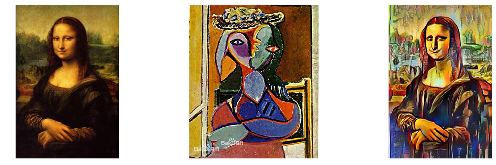
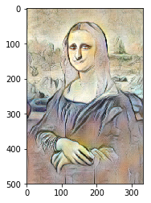

## 毕加索
巴勃罗·毕加索（Pablo Picasso，1881年10月25日～1973年4月8日），西班牙画家、雕塑家，法国共产党党员。是现代艺术的创始人，西方现代派绘画的主要代表。毕加索是当代西方最有创造性和影响最深远的艺术家，是20世纪最伟大的艺术天才之一。、
## 风格介绍
毕加索的艺术生涯几乎贯穿其一生，作品风格丰富多样，后人用“毕加索永远是年轻的”的说法形容毕加索多变的艺术形式。史学上不得不把他浩繁的作品分为不同的时期——早年的“蓝色时期”、“粉红色时期”、盛年的“黑人时期”、“分析和综合立体主义时期”（又称“立体主义时期”）、后来的“超现实主义时期”等等。 他于1907年创作的《亚威农少女》是第一张被认为有立体主义倾向的作品，是一幅具有里程碑意义的著名杰作。它不仅标志着毕加索个人艺术历程中的重大转折，而且也是西方现代艺术史上的一次革命性突破，引发了立体主义运动的诞生。
##### 以上都不是我知道的，都现买现卖抄自百度百科里的O(∩_∩)O

# 成品展示
## 毕加索画风的蒙娜丽莎


```python
%matplotlib inline
from PIL import Image
import matplotlib.pyplot as plt
plt.figure(figsize=[20,6])
plt.subplot(1,3,1)
plt.imshow(Image.open('work/MonaLisa.jpg'))
plt.axis('off')
plt.xticks([])
plt.subplot(1,3,2)
plt.imshow(Image.open('work/style.jpg'))
plt.axis('off')
plt.xticks([])
plt.subplot(1,3,3)
plt.imshow(Image.open('transfer_result/ndarray_1590844241.6393652.jpg'))
plt.axis('off')
plt.xticks([])
plt.show()
```





## 毕加索画风的BadAppleMV


```python
from IPython.display import HTML
HTML('<iframe style="width:98%;height: 450px;" src=//player.bilibili.com/player.html?aid=710442177&bvid=BV1QQ4y1P745&cid=184801392&page=1" scrolling="no" border="0" frameborder="no" framespacing="0" allowfullscreen="true"> </iframe>" scrolling="no" border="0" frameborder="no" framespacing="0" allowfullscreen="true"> </iframe>" scrolling="no" border="0" frameborder="no" framespacing="0" allowfullscreen="true"> </iframe>" scrolling="no" border="0" frameborder="no" framespacing="0" allowfullscreen="true"> </iframe>"   webkitallowfullscreen="true" mozallowfullscreen="true" scrolling="no" border="0" frameborder="no" framespacing="0" allowfullscreen="true"> </iframe>')
```

    /opt/conda/envs/python35-paddle120-env/lib/python3.7/site-packages/IPython/core/display.py:694: UserWarning: Consider using IPython.display.IFrame instead
      warnings.warn("Consider using IPython.display.IFrame instead")


<iframe style="width:98%;height: 450px;" src=//player.bilibili.com/player.html?aid=710442177&bvid=BV1QQ4y1P745&cid=184801392&page=1" scrolling="no" border="0" frameborder="no" framespacing="0" allowfullscreen="true"> </iframe>" scrolling="no" border="0" frameborder="no" framespacing="0" allowfullscreen="true"> </iframe>" scrolling="no" border="0" frameborder="no" framespacing="0" allowfullscreen="true"> </iframe>" scrolling="no" border="0" frameborder="no" framespacing="0" allowfullscreen="true"> </iframe>"   webkitallowfullscreen="true" mozallowfullscreen="true" scrolling="no" border="0" frameborder="no" framespacing="0" allowfullscreen="true"> </iframe>


### 获取相关图片


```python
!wget -O work/style.jpg https://bkimg.cdn.bcebos.com/pic/203fb80e7bec54e7ddbcbb56b8389b504fc26a22?x-bce-process=image/watermark,g_7,image_d2F0ZXIvYmFpa2U4MA==,xp_5,yp_5
!wget -O work/MonaLisa.jpg https://bkimg.cdn.bcebos.com/pic/4610b912c8fcc3ceb33fb3d19945d688d53f2050?x-bce-process=image/resize,m_lfit,w_500,h_500,limit_1
```

    --2020-05-30 21:06:54--  https://bkimg.cdn.bcebos.com/pic/4610b912c8fcc3ceb33fb3d19945d688d53f2050?x-bce-process=image/resize,m_lfit,w_500,h_500,limit_1
    Resolving bkimg.cdn.bcebos.com (bkimg.cdn.bcebos.com)... 182.61.128.198
    Connecting to bkimg.cdn.bcebos.com (bkimg.cdn.bcebos.com)|182.61.128.198|:443... connected.
    HTTP request sent, awaiting response... 200 OK
    Length: 22009 (21K) [image/jpeg]
    Saving to: ‘work/MonaLisa.jpg’
    
    work/MonaLisa.jpg   100%[===================>]  21.49K  --.-KB/s    in 0s      
    
    2020-05-30 21:06:54 (83.7 MB/s) - ‘work/MonaLisa.jpg’ saved [22009/22009]
    


## stylepro_artistic接口介绍
这里使用stylepro_artistic模型其模型接口说明如下：
```python
def style_transfer(self,
                   images=None,
                   paths=None,
                   alpha=1,
                   use_gpu=False,
                   visualization=False,
                   output_dir='transfer_result'):
```
1. images (list[dict]): ndarray 格式的图片数据。每一个元素都为一个 dict，有关键字 content, styles, weights(可选)，相应取值为：
1. content (numpy.ndarray): 待转换的图片，shape 为 [H, W, C]，BGR格式；
1. styles (list[numpy.ndarray]) : 作为底色的风格图片组成的列表，各个图片数组的shape 都是 [H, W, C]，BGR格式；
1. weights (list[float], optioal) : 各个 style 对应的权重。当不设置 weights 时，默认各个 style 有着相同的权重；
1. paths (list[str]): 图片的路径。每一个元素都为一个 dict，有关键字 content, styles, weights(可选)，相应取值为：
1. content (str): 待转换的图片的路径；
1. styles (list[str]) : 作为底色的风格图片的路径；
1. weights (list[float], optioal) : 各个 style 对应的权重。当不设置 weights 时，各个 style 的权重相同；
1. alpha (float) : 转换的强度，[0, 1] 之间，默认值为1；
1. use_gpu (bool): 是否使用 GPU；
1. visualization (bool): 是否将结果保存为图片，默认为 False;
1. output_dir (str): 图片的保存路径，默认设为 transfer_result 。


```python
# 安装stylepro_artistic
!pip install --upgrade paddlehub -i https://pypi.tuna.tsinghua.edu.cn/simple
!hub install stylepro_artistic
```

    Looking in indexes: https://pypi.tuna.tsinghua.edu.cn/simple
    Collecting paddlehub
    [?25l  Downloading https://pypi.tuna.tsinghua.edu.cn/packages/c4/42/f5f7739e1f411999c601c8a8f9afd52b5393f1860722ca02244f2e1dc4a6/paddlehub-1.7.0-py3-none-any.whl (290kB)
         |████████████████████████████████| 296kB 8.2MB/s eta 0:00:01
    [?25hRequirement already satisfied, skipping upgrade: flake8 in /opt/conda/envs/python35-paddle120-env/lib/python3.7/site-packages (from paddlehub) (3.7.9)
    Requirement already satisfied, skipping upgrade: six>=1.10.0 in /opt/conda/envs/python35-paddle120-env/lib/python3.7/site-packages (from paddlehub) (1.12.0)
    Requirement already satisfied, skipping upgrade: colorlog in /opt/conda/envs/python35-paddle120-env/lib/python3.7/site-packages (from paddlehub) (4.1.0)
    Requirement already satisfied, skipping upgrade: sentencepiece in /opt/conda/envs/python35-paddle120-env/lib/python3.7/site-packages (from paddlehub) (0.1.85)
    Collecting visualdl==2.0.0b1 (from paddlehub)
    [?25l  Downloading https://pypi.tuna.tsinghua.edu.cn/packages/ad/29/cadee04980b10757df62f7eb19e92b6ec95e00c0bcba89a3d1454c492cba/visualdl-2.0.0b1-py3-none-any.whl (1.6MB)
         |████████████████████████████████| 1.6MB 44kB/s eta 0:00:0101
    [?25hRequirement already satisfied, skipping upgrade: yapf==0.26.0 in /opt/conda/envs/python35-paddle120-env/lib/python3.7/site-packages (from paddlehub) (0.26.0)
    Requirement already satisfied, skipping upgrade: cma>=2.7.0 in /opt/conda/envs/python35-paddle120-env/lib/python3.7/site-packages (from paddlehub) (2.7.0)
    Requirement already satisfied, skipping upgrade: gunicorn>=19.10.0; sys_platform != "win32" in /opt/conda/envs/python35-paddle120-env/lib/python3.7/site-packages (from paddlehub) (20.0.4)
    Requirement already satisfied, skipping upgrade: protobuf>=3.6.0 in /opt/conda/envs/python35-paddle120-env/lib/python3.7/site-packages (from paddlehub) (3.10.0)
    Requirement already satisfied, skipping upgrade: flask>=1.1.0 in /opt/conda/envs/python35-paddle120-env/lib/python3.7/site-packages (from paddlehub) (1.1.1)
    Requirement already satisfied, skipping upgrade: pre-commit in /opt/conda/envs/python35-paddle120-env/lib/python3.7/site-packages (from paddlehub) (1.21.0)
    Requirement already satisfied, skipping upgrade: pandas; python_version >= "3" in /opt/conda/envs/python35-paddle120-env/lib/python3.7/site-packages (from paddlehub) (0.23.4)
    Requirement already satisfied, skipping upgrade: pyflakes<2.2.0,>=2.1.0 in /opt/conda/envs/python35-paddle120-env/lib/python3.7/site-packages (from flake8->paddlehub) (2.1.1)
    Requirement already satisfied, skipping upgrade: mccabe<0.7.0,>=0.6.0 in /opt/conda/envs/python35-paddle120-env/lib/python3.7/site-packages (from flake8->paddlehub) (0.6.1)
    Requirement already satisfied, skipping upgrade: entrypoints<0.4.0,>=0.3.0 in /opt/conda/envs/python35-paddle120-env/lib/python3.7/site-packages (from flake8->paddlehub) (0.3)
    Requirement already satisfied, skipping upgrade: pycodestyle<2.6.0,>=2.5.0 in /opt/conda/envs/python35-paddle120-env/lib/python3.7/site-packages (from flake8->paddlehub) (2.5.0)
    Collecting Flask-Babel>=1.0.0 (from visualdl==2.0.0b1->paddlehub)
      Downloading https://pypi.tuna.tsinghua.edu.cn/packages/76/a4/0115c7c520125853037fc1d6b3da132a526949640e27a699a13e05ec7593/Flask_Babel-1.0.0-py3-none-any.whl
    Requirement already satisfied, skipping upgrade: opencv-python in /opt/conda/envs/python35-paddle120-env/lib/python3.7/site-packages (from visualdl==2.0.0b1->paddlehub) (4.1.1.26)
    Requirement already satisfied, skipping upgrade: numpy in /opt/conda/envs/python35-paddle120-env/lib/python3.7/site-packages (from visualdl==2.0.0b1->paddlehub) (1.16.4)
    Requirement already satisfied, skipping upgrade: requests in /opt/conda/envs/python35-paddle120-env/lib/python3.7/site-packages (from visualdl==2.0.0b1->paddlehub) (2.22.0)
    Collecting Pillow>=7.0.0 (from visualdl==2.0.0b1->paddlehub)
    [?25l  Downloading https://pypi.tuna.tsinghua.edu.cn/packages/ab/f8/d3627cc230270a6a4eedee32974fbc8cb26c5fdb8710dd5ea70133640022/Pillow-7.1.2-cp37-cp37m-manylinux1_x86_64.whl (2.1MB)
         |████████████████████████████████| 2.1MB 54.2MB/s eta 0:00:01
    [?25hRequirement already satisfied, skipping upgrade: setuptools>=3.0 in /opt/conda/envs/python35-paddle120-env/lib/python3.7/site-packages (from gunicorn>=19.10.0; sys_platform != "win32"->paddlehub) (41.4.0)
    Requirement already satisfied, skipping upgrade: click>=5.1 in /opt/conda/envs/python35-paddle120-env/lib/python3.7/site-packages (from flask>=1.1.0->paddlehub) (7.0)
    Requirement already satisfied, skipping upgrade: Werkzeug>=0.15 in /opt/conda/envs/python35-paddle120-env/lib/python3.7/site-packages (from flask>=1.1.0->paddlehub) (0.16.0)
    Requirement already satisfied, skipping upgrade: itsdangerous>=0.24 in /opt/conda/envs/python35-paddle120-env/lib/python3.7/site-packages (from flask>=1.1.0->paddlehub) (1.1.0)
    Requirement already satisfied, skipping upgrade: Jinja2>=2.10.1 in /opt/conda/envs/python35-paddle120-env/lib/python3.7/site-packages (from flask>=1.1.0->paddlehub) (2.10.3)
    Requirement already satisfied, skipping upgrade: cfgv>=2.0.0 in /opt/conda/envs/python35-paddle120-env/lib/python3.7/site-packages (from pre-commit->paddlehub) (2.0.1)
    Requirement already satisfied, skipping upgrade: pyyaml in /opt/conda/envs/python35-paddle120-env/lib/python3.7/site-packages (from pre-commit->paddlehub) (5.1.2)
    Requirement already satisfied, skipping upgrade: nodeenv>=0.11.1 in /opt/conda/envs/python35-paddle120-env/lib/python3.7/site-packages (from pre-commit->paddlehub) (1.3.4)
    Requirement already satisfied, skipping upgrade: toml in /opt/conda/envs/python35-paddle120-env/lib/python3.7/site-packages (from pre-commit->paddlehub) (0.10.0)
    Requirement already satisfied, skipping upgrade: importlib-metadata; python_version < "3.8" in /opt/conda/envs/python35-paddle120-env/lib/python3.7/site-packages (from pre-commit->paddlehub) (0.23)
    Requirement already satisfied, skipping upgrade: virtualenv>=15.2 in /opt/conda/envs/python35-paddle120-env/lib/python3.7/site-packages (from pre-commit->paddlehub) (16.7.9)
    Requirement already satisfied, skipping upgrade: identify>=1.0.0 in /opt/conda/envs/python35-paddle120-env/lib/python3.7/site-packages (from pre-commit->paddlehub) (1.4.10)
    Requirement already satisfied, skipping upgrade: aspy.yaml in /opt/conda/envs/python35-paddle120-env/lib/python3.7/site-packages (from pre-commit->paddlehub) (1.3.0)
    Requirement already satisfied, skipping upgrade: python-dateutil>=2.5.0 in /opt/conda/envs/python35-paddle120-env/lib/python3.7/site-packages (from pandas; python_version >= "3"->paddlehub) (2.8.0)
    Requirement already satisfied, skipping upgrade: pytz>=2011k in /opt/conda/envs/python35-paddle120-env/lib/python3.7/site-packages (from pandas; python_version >= "3"->paddlehub) (2019.3)
    Collecting Babel>=2.3 (from Flask-Babel>=1.0.0->visualdl==2.0.0b1->paddlehub)
    [?25l  Downloading https://pypi.tuna.tsinghua.edu.cn/packages/15/a1/522dccd23e5d2e47aed4b6a16795b8213e3272c7506e625f2425ad025a19/Babel-2.8.0-py2.py3-none-any.whl (8.6MB)
         |████████████████████████████████| 8.6MB 20kB/s eta 0:00:0111
    [?25hRequirement already satisfied, skipping upgrade: chardet<3.1.0,>=3.0.2 in /opt/conda/envs/python35-paddle120-env/lib/python3.7/site-packages (from requests->visualdl==2.0.0b1->paddlehub) (3.0.4)
    Requirement already satisfied, skipping upgrade: idna<2.9,>=2.5 in /opt/conda/envs/python35-paddle120-env/lib/python3.7/site-packages (from requests->visualdl==2.0.0b1->paddlehub) (2.8)
    Requirement already satisfied, skipping upgrade: urllib3!=1.25.0,!=1.25.1,<1.26,>=1.21.1 in /opt/conda/envs/python35-paddle120-env/lib/python3.7/site-packages (from requests->visualdl==2.0.0b1->paddlehub) (1.25.6)
    Requirement already satisfied, skipping upgrade: certifi>=2017.4.17 in /opt/conda/envs/python35-paddle120-env/lib/python3.7/site-packages (from requests->visualdl==2.0.0b1->paddlehub) (2019.9.11)
    Requirement already satisfied, skipping upgrade: MarkupSafe>=0.23 in /opt/conda/envs/python35-paddle120-env/lib/python3.7/site-packages (from Jinja2>=2.10.1->flask>=1.1.0->paddlehub) (1.1.1)
    Requirement already satisfied, skipping upgrade: zipp>=0.5 in /opt/conda/envs/python35-paddle120-env/lib/python3.7/site-packages (from importlib-metadata; python_version < "3.8"->pre-commit->paddlehub) (0.6.0)
    Requirement already satisfied, skipping upgrade: more-itertools in /opt/conda/envs/python35-paddle120-env/lib/python3.7/site-packages (from zipp>=0.5->importlib-metadata; python_version < "3.8"->pre-commit->paddlehub) (7.2.0)
    ERROR: visualdl 2.0.0b1 has requirement six>=1.14.0, but you'll have six 1.12.0 which is incompatible.
    Installing collected packages: Babel, Flask-Babel, Pillow, visualdl, paddlehub
      Found existing installation: Pillow 6.2.0
        Uninstalling Pillow-6.2.0:
          Successfully uninstalled Pillow-6.2.0
      Found existing installation: visualdl 1.3.0
        Uninstalling visualdl-1.3.0:
          Successfully uninstalled visualdl-1.3.0
      Found existing installation: paddlehub 1.6.0
        Uninstalling paddlehub-1.6.0:
          Successfully uninstalled paddlehub-1.6.0
    Successfully installed Babel-2.8.0 Flask-Babel-1.0.0 Pillow-7.1.2 paddlehub-1.7.0 visualdl-2.0.0b1
    /opt/conda/envs/python35-paddle120-env/lib/python3.7/site-packages/sklearn/externals/joblib/externals/cloudpickle/cloudpickle.py:47: DeprecationWarning: the imp module is deprecated in favour of importlib; see the module's documentation for alternative uses
      import imp
    2020-05-30 21:08:08,928-INFO: font search path ['/opt/conda/envs/python35-paddle120-env/lib/python3.7/site-packages/matplotlib/mpl-data/fonts/ttf', '/opt/conda/envs/python35-paddle120-env/lib/python3.7/site-packages/matplotlib/mpl-data/fonts/afm', '/opt/conda/envs/python35-paddle120-env/lib/python3.7/site-packages/matplotlib/mpl-data/fonts/pdfcorefonts']
    2020-05-30 21:08:09,347-INFO: generated new fontManager
    Downloading stylepro_artistic
    [==================================================] 100.00%
    Uncompress /home/aistudio/.paddlehub/tmp/tmpbla21_e7/stylepro_artistic
    [==================================================] 100.00%
    Successfully installed stylepro_artistic-1.0.0


## 单个图像的融合
### 当蒙娜丽莎遇上毕加索的画风时


```python
%matplotlib inline
import matplotlib.pyplot as plt
import paddlehub as hub
import cv2

stylepro_artistic = hub.Module(name="stylepro_artistic")
result = stylepro_artistic.style_transfer(
    images=[{
        'content': cv2.imread('work/MonaLisa.jpg'),
        'styles': [cv2.imread('work/style.jpg')]
    }],
    alpha=1,
    visualization=True)
    
plt.imshow(result[0]['data'])

```

    [2020-08-01 20:13:15,228] [    INFO] - Installing stylepro_artistic module
    [2020-08-01 20:13:15,229] [    INFO] - Module stylepro_artistic already installed in /home/aistudio/.paddlehub/modules/stylepro_artistic


```python
import paddlehub as hub


stylepro_artistic = hub.Module(name="stylepro_artistic")
result = stylepro_artistic.style_transfer(
    paths=[{
        'content':'work/MonaLisa.jpg',
        'styles': ['work/style3.jpg']
    }],
    visualization=False)
# print(result)

```

    [2020-08-06 14:41:47,597] [    INFO] - Installing stylepro_artistic module


    Downloading stylepro_artistic
    [==================================================] 100.00%
    Uncompress /home/aistudio/.paddlehub/tmp/tmpre7qutmr/stylepro_artistic
    [==================================================] 100.00%


    [2020-08-06 14:41:54,204] [    INFO] - Successfully installed stylepro_artistic-1.0.0


```python
%matplotlib inline
import matplotlib.pyplot as plt
plt.imshow(result[0]['data'])
```

    2020-08-06 14:42:07,500-INFO: font search path ['/opt/conda/envs/python35-paddle120-env/lib/python3.7/site-packages/matplotlib/mpl-data/fonts/ttf', '/opt/conda/envs/python35-paddle120-env/lib/python3.7/site-packages/matplotlib/mpl-data/fonts/afm', '/opt/conda/envs/python35-paddle120-env/lib/python3.7/site-packages/matplotlib/mpl-data/fonts/pdfcorefonts']
    2020-08-06 14:42:08,042-INFO: generated new fontManager


    <matplotlib.image.AxesImage at 0x7f271a6e0c50>





### 显示原图，style的图片以及，合成后的图片


```python
%matplotlib inline
from PIL import Image
import matplotlib.pyplot as plt
plt.figure(figsize=[20,6])
plt.subplot(1,3,1)
plt.imshow(Image.open('work/MonaLisa.jpg'))
plt.axis('off')
plt.xticks([])
plt.subplot(1,3,2)
plt.imshow(Image.open('work/style.jpg'))
plt.axis('off')
plt.xticks([])
plt.subplot(1,3,3)
plt.imshow(Image.open('transfer_result/ndarray_1590844241.6393652.jpg'))
plt.axis('off')
plt.xticks([])
plt.show()
```


## 更大胆的想法
当BadApple MV与上毕加索画风时，
##### BadApple是网友特喜欢玩的一个动画，经常有技术宅大佬把这些MV放到各种能亮的设备上播放


```python
# 这里将视频的每一帧都提取出来了
# 然后根据每一帧进行处理，这里保留源码，但后面代码与此无关，可以直接运行后面的
import cv2
from tqdm import tqdm
video = cv2.VideoCapture("work/badapple.mp4")
fps = video.get(cv2.CAP_PROP_FPS)
frameCount = video.get(cv2.CAP_PROP_FRAME_COUNT)
size = (int(video.get(cv2.CAP_PROP_FRAME_WIDTH)), int(video.get(cv2.CAP_PROP_FRAME_HEIGHT)))
print("总共的帧数为：",frameCount)
success, frame = video.read() 
index = 0
for i in tqdm(range(int(frameCount)),desc='处理进度'):
    if success:
        cv2.imwrite('work/target/'+str(index)+'.jpg', frame)
    success, frame = video.read()
    index += 1
    if index == 400:
        break
```

    处理进度:   1%|▏         | 71/5379 [00:00<00:14, 364.11it/s]

    总共的帧数为： 5379.0


    处理进度:   2%|▏         | 105/5379 [00:00<00:14, 353.90it/s]处理进度:   7%|▋         | 381/5379 [00:01<00:15, 325.12it/s]


### 将视频的每一帧与图片进行融合，最后保存为图片
##### 这是一个漫长的过程CPU跑了16个小时


```python
%env CUDA_VISIBLE_DEVICES=0 # 指定GPU设备
import cv2
import paddlehub as hub
from tqdm import tqdm
stylepro_artistic = hub.Module(name="stylepro_artistic")
video = cv2.VideoCapture("work/badapple.mp4")
fps = video.get(cv2.CAP_PROP_FPS)
frameCount = video.get(cv2.CAP_PROP_FRAME_COUNT)
size = (int(video.get(cv2.CAP_PROP_FRAME_WIDTH)), int(video.get(cv2.CAP_PROP_FRAME_HEIGHT)))
print("总共的帧数为：",frameCount)
success, frame = video.read() 
file_paths = []
index = 0
for i in tqdm(range(int(frameCount))):
    if success and index > 33:
            result = stylepro_artistic.style_transfer(
                images=[{
                    'content': frame,
                    'styles': [cv2.imread('work/style.jpg')]
                }],
                visualization=True,
                use_gpu=True,
                output_dir='transvideo_result')
            file_paths.append(result[0]['save_path'])
    elif success:
        filep = 'transvideo_result/'+str(index)+'.jpg'
        cv2.imwrite(filep, frame)
        file_paths.append(filep)
    success, frame = video.read()
    index += 1
videoWriter = cv2.VideoWriter('transbadaplle.avi', cv2.VideoWriter_fourcc(*"MJPG"), fps, size)
flag = True
for i in tqdm(file_paths):
    videoWriter.write(cv2.imread(i))
videoWriter.release()
```

    [2020-06-01 15:24:52,634] [    INFO] - Installing stylepro_artistic module
    [2020-06-01 15:24:52,636] [    INFO] - Module stylepro_artistic already installed in /home/aistudio/.paddlehub/modules/stylepro_artistic


    env: CUDA_VISIBLE_DEVICES=0


      0%|          | 0/5379 [00:00<?, ?it/s]

    总共的帧数为： 5379.0


    100%|██████████| 5379/5379 [39:44<00:00,  2.26it/s]


### 将图片合成为视频


```python
import os
import cv2
import datetime
from tqdm import tqdm
file_dict = {}
video = cv2.VideoCapture("work/badapple.mp4")
fps = video.get(cv2.CAP_PROP_FPS)
frameCount = video.get(cv2.CAP_PROP_FRAME_COUNT)
size = (int(video.get(cv2.CAP_PROP_FRAME_WIDTH)), int(video.get(cv2.CAP_PROP_FRAME_HEIGHT)))
for i in os.listdir('transvideo_result/'):
    file_dict['transvideo_result/'+i] = float(i.replace('ndarray_','').replace('.jpg',''))
file_dict = sorted(file_dict.items(),key = lambda x:x[1])
videoWriter = cv2.VideoWriter('transbadaplle.avi', cv2.VideoWriter_fourcc(*"MJPG"), fps, size)
flag = True
for i in tqdm(file_dict):
    if flag:
        for j in range(34):
            videoWriter.write(cv2.imread('work/target/0.jpg'))
        flag = False
    videoWriter.write(cv2.imread(i[0]))
videoWriter.release()
# cv2.destroyAllWindows()
```

    100%|██████████| 5345/5345 [00:31<00:00, 170.87it/s]


## 成品展示


```python
from IPython.display import HTML
HTML('<iframe style="width:98%;height: 450px;" src=//player.bilibili.com/player.html?aid=710442177&bvid=BV1QQ4y1P745&cid=184801392&page=1" scrolling="no" border="0" frameborder="no" framespacing="0" allowfullscreen="true"> </iframe>" scrolling="no" border="0" frameborder="no" framespacing="0" allowfullscreen="true"> </iframe>" scrolling="no" border="0" frameborder="no" framespacing="0" allowfullscreen="true"> </iframe>" scrolling="no" border="0" frameborder="no" framespacing="0" allowfullscreen="true"> </iframe>"   webkitallowfullscreen="true" mozallowfullscreen="true" scrolling="no" border="0" frameborder="no" framespacing="0" allowfullscreen="true"> </iframe>')
```

    /opt/conda/envs/python35-paddle120-env/lib/python3.7/site-packages/IPython/core/display.py:694: UserWarning: Consider using IPython.display.IFrame instead
      warnings.warn("Consider using IPython.display.IFrame instead")


<iframe style="width:98%;height: 450px;" src=//player.bilibili.com/player.html?aid=710442177&bvid=BV1QQ4y1P745&cid=184801392&page=1" scrolling="no" border="0" frameborder="no" framespacing="0" allowfullscreen="true"> </iframe>" scrolling="no" border="0" frameborder="no" framespacing="0" allowfullscreen="true"> </iframe>" scrolling="no" border="0" frameborder="no" framespacing="0" allowfullscreen="true"> </iframe>" scrolling="no" border="0" frameborder="no" framespacing="0" allowfullscreen="true"> </iframe>"   webkitallowfullscreen="true" mozallowfullscreen="true" scrolling="no" border="0" frameborder="no" framespacing="0" allowfullscreen="true"> </iframe>


### 网络一键部署


```python
# hub serving start -m stylepro_artistic
```


```python
import requests
import json
import cv2
import base64
import paddlehub as hub
import numpy as np
%matplotlib inline
import matplotlib.pyplot as plt

def cv2_to_base64(image):
    data = cv2.imencode('.jpg', image)[1]
    return base64.b64encode(data.tostring()).decode('utf8')

def base64_to_cv2(b64str):
    data = base64.b64decode(b64str.encode('utf8'))
    data = np.fromstring(data, np.uint8)
    data = cv2.imdecode(data, cv2.IMREAD_COLOR)
    return data

data = {'images':[
    {
        'content':cv2_to_base64(cv2.imread('work/MonaLisa.jpg')),
        'styles':[cv2_to_base64(cv2.imread('work/style.jpg'))]
    }
]}

headers = {"Content-type": "application/json"}
url = "http://127.0.0.1:8866/predict/stylepro_artistic"
r = requests.post(url=url, headers=headers, data=json.dumps(data))

plt.imshow(base64_to_cv2(r.json()["results"][0]['data']))
# print(base64_to_cv2(r.json()["results"][0]['data']))
```


    ---------------------------------------------------------------------------

    IndexError                                Traceback (most recent call last)

    <ipython-input-6-a9a4f7a35f36> in <module>
         30 r = requests.post(url=url, headers=headers, data=json.dumps(data))
         31 
    ---> 32 plt.imshow(base64_to_cv2(r.json()["results"][0]['data']))
         33 # print(base64_to_cv2(r.json()["results"][0]['data']))


    IndexError: string index out of range


```python
r.json()
```


    {'msg': 'Please check data format!', 'results': '', 'status': '-1'}


请点击[此处](https://ai.baidu.com/docs#/AIStudio_Project_Notebook/a38e5576)查看本环境基本用法.  <br>
Please click [here ](https://ai.baidu.com/docs#/AIStudio_Project_Notebook/a38e5576) for more detailed instructions. 
